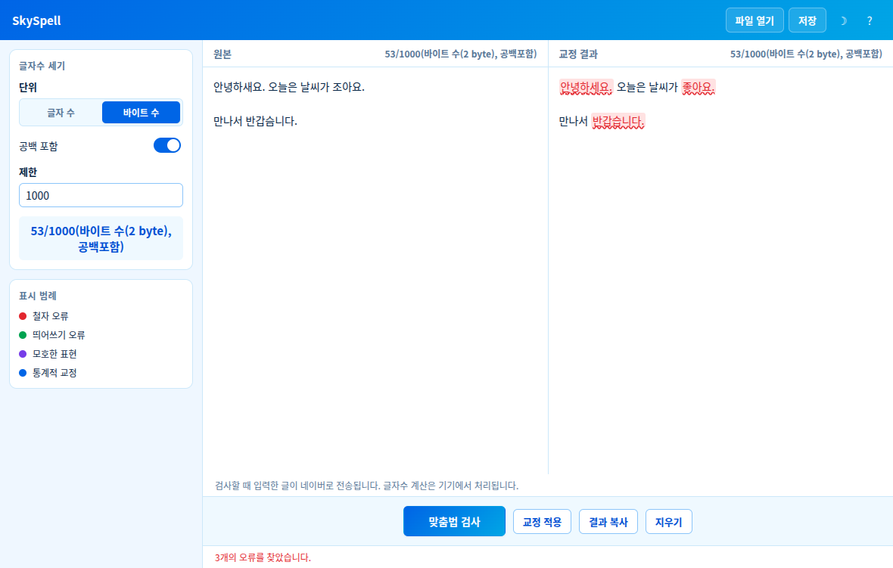

# SkySpell

하늘색 테마의 크로스플랫폼(Windows · Linux) 한국어 맞춤법 검사 · 글자수 세기 프로그램입니다.




## 주요 기능

**맞춤법 검사**
- 원본과 교정 결과를 나란히 표시, 오류 유형별 색상 하이라이트(철자/띄어쓰기/모호한 표현/통계적 교정)
- 교정 결과 전체를 원본 입력창에 한 번에 적용, 결과 복사
- 긴 글은 490자 이하로 나누어 순서대로 검사(청크 사이 200ms 대기, 요청당 15초 제한), 줄바꿈 보존

**글자수 세기**
- 실시간 글자 수 / 바이트 수 표시, 원하는 제한(목표) 값 설정
- 공백 포함 / 제외 선택
- 표시 예: `868/1000(바이트 수(2 byte), 공백포함)` — 바이트 수는 한글 1자를 2바이트로 세는 관례(자기소개서·문서작성기에서 흔히 쓰는 방식)를 따릅니다

**기타**
- OS 언어와 관계없이 한국어 메뉴·UI
- 텍스트 파일 열기/저장, 클립보드 복사
- 다크 모드
- GitHub Releases 기반 자동 업데이트

## 기술 스택

- [Electron](https://www.electronjs.org/) — Windows/Linux 크로스플랫폼 데스크톱 셸
- `electron-store` — 설정 로컬 영속화
- `electron-builder` + `electron-updater` — 패키징 및 자동 업데이트
- 네이버 맞춤법 검사기의 비공식 엔드포인트(`SpellerProxy`) — 아래 "참고 및 주의사항" 참조

## 개발

Node.js 24 LTS를 권장합니다(`.nvmrc`, 최소 22.12). 설치된 앱을 사용할 때는 Node.js가 필요 없습니다.

```bash
npm ci
npm start         # 앱 실행
npm run lint       # ESLint
npm test           # 글자수 · 파서 · API 오류/재시도/분할 테스트
npm run test:gui   # 실제 Electron 창을 띄우는 GUI 회귀 검사(임시 프로필)
npm run test:gui -- --live # 네이버 실서비스 교정도 확인
```

## 빌드

```bash
npm run dist:win     # Windows 설치 파일(nsis)
npm run dist:linux   # Linux AppImage / deb
```

## 배포 / 자동 업데이트

저장소 주소는 `3rdappsmod/SkySpell`로 설정되어 있습니다. 다른 이름/소유자로 올린다면 `package.json`의 `repository`와 `build.publish`를 먼저 바꾸세요. 로컬에서 원격 저장소를 만들거나 push하지 않습니다.

`package.json` 버전과 일치하는 `v*` 태그(예: `v0.1.0`)를 push하면 Windows NSIS와 Linux AppImage/deb를 빌드해 **Release 초안**을 만듭니다. 두 운영체제의 빌드 완료와 설치 파일을 확인한 뒤 초안을 공개하세요. 공개된 새 버전을 배포 앱이 자동 확인합니다. Windows NSIS와 Linux AppImage를 자동 업데이트 대상으로 사용하고, deb는 새 패키지를 직접 설치하세요. 코드 서명 인증서는 설정되어 있지 않습니다.

Dependabot이 npm 및 Actions 의존성을 매주 확인합니다. CI는 lint·단위 테스트 및 Windows/Linux **설치 파일 생성**을 검사합니다. 봇은 네이버 API 변경을 자동으로 고쳐주지 않으므로 실서비스 검사는 별도로 수행해야 합니다.

patch/minor 자동 병합은 다음 저장소 설정을 완료한 뒤 활성화하세요.

1. GitHub Settings → General에서 **Allow auto-merge**, **Squash merging** 활성화.
2. 기본 브랜치(main)에 보호 규칙 또는 ruleset을 만들고 PR 및 `lint`, `build (ubuntu-latest, --linux)`, `build (windows-latest, --win)` 성공을 필수로 지정. 실제 첫 CI 실행의 검사 이름을 확인하세요.
3. Settings → Secrets and variables → Actions → Variables에 `DEPENDABOT_AUTO_MERGE=true` 추가.

변수를 설정하기 전에는 자동 병합 작업을 건너뜁니다. major 업데이트는 사람이 검토합니다. 로컬 YAML 파일만으로 GitHub 브랜치 보호나 저장소 옵션이 활성화되지는 않습니다.

## 참고 및 주의사항

이 프로젝트는 다음 저장소들을 참고해 만들었습니다.

- [py-hanspell](https://github.com/ssut/py-hanspell) — 네이버 맞춤법 검사기를 호출하는 파이썬 라이브러리. 응답 html의 오류 유형(철자/띄어쓰기/모호/통계적 교정) 태그 파싱 방식을 참고했습니다.
- [vscode-korean-grammar-checker](https://github.com/moonkorea00/vscode-korean-grammar-checker) — 같은 네이버 엔드포인트를 `passportKey`와 함께 호출하는 VS Code 확장. passportKey 발급/재시도 방식을 참고했습니다.
- [JamSpell](https://github.com/bakwc/JamSpell) — 빠른 다국어 spell checker이지만 한국어 사전/언어 모델이 기본 제공되지 않아 이번 프로젝트에는 사용하지 않았습니다.

맞춤법 검사 기능은 네이버의 **비공식** 엔드포인트를 사용합니다. 공식적으로 공개된 API가 아니므로 네이버 측 정책이나 페이지 구조가 바뀌면 예고 없이 동작하지 않을 수 있습니다. 과도하게 자주 요청하지 마세요. **맞춤법 검사를 실행하면 입력한 글이 네이버로 전송됩니다.** 글자수 계산은 오프라인에서 가능합니다. 바이트 표시는 실제 UTF-8 용량이 아니라 비 ASCII 문자 2바이트/ASCII 1바이트 규칙이며, 공백 제외는 줄바꿈·탭도 제외합니다.

## 라이선스

[MIT](LICENSE)
